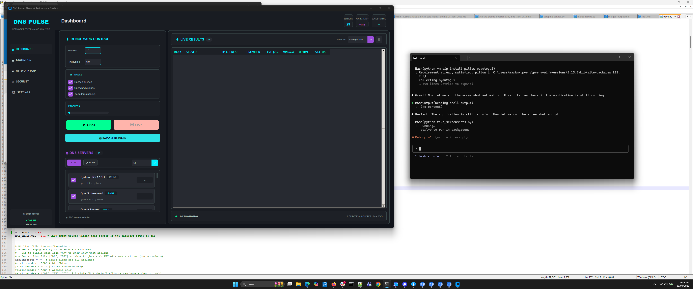
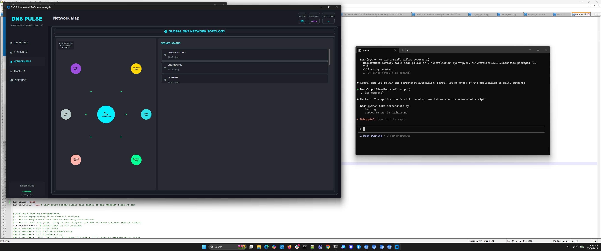
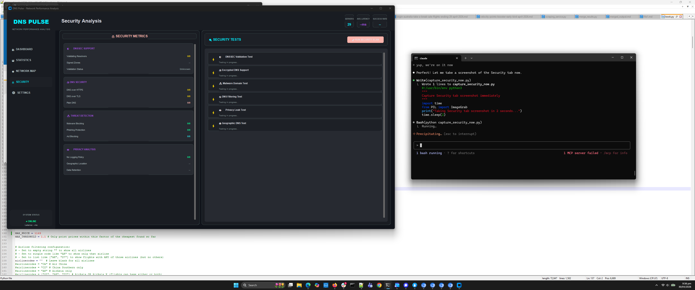

# DNS Benchmark Laboratory

A comprehensive, modern DNS benchmarking application with real-time performance analysis, security testing, and network visualization. Built with the DNS Pulse design system for a sleek, professional user experience.


## 🌟 Key Features

### 🚀 Performance Benchmarking
- **Multi-threaded DNS testing** with configurable concurrency (up to 50 workers)
- **Comprehensive metrics**: Average, Min, Max, Percentiles (50th, 90th, 95th, 99th)
- **Multiple test types**: Cached vs uncached queries, .com domain focus
- **Real-time progress tracking** with animated visualizations
- **25+ public DNS servers** including Google, Cloudflare, Quad9, OpenDNS

### 📊 Advanced Analytics
- **Real-time charts** with matplotlib integration
- **Interactive graphs**: Response time comparisons, distribution histograms
- **Provider performance analysis** with geographic insights  
- **Reliability vs Speed scatter plots**
- **Live performance dashboard** with top performers and success rates

### 🌐 Network Topology Visualization
- **Global DNS network map** with visual server topology
- **Live status indicators** with color-coded response times
- **Real-time connection monitoring** during benchmarking
- **Geographic server distribution** analysis

### 🔒 Security Analysis
- **DNSSEC validation testing** - Validates DNS Security Extensions support
- **Encrypted DNS detection** - Tests DNS-over-TLS (DoT) and DNS-over-HTTPS (DoH)
- **Malware domain filtering** - Checks protection against malicious domains
- **Privacy leak analysis** - Tests for client IP tracking and geographic queries
- **Comprehensive scoring** with detailed security reports

### 🎨 Modern UI Design
- **DNS Pulse design system** with glassmorphic aesthetics
- **Dark theme** with cyan (#00F0FF) and electric violet (#9D4EDD) accents
- **Persistent tab management** - Data preserved when switching tabs
- **Real-time cross-tab updates** during benchmarking
- **Responsive card-based layouts** with subtle animations

## 🛠️ Tech Stack

### Core Framework
- **Python 3.8+** - Main application language
- **CustomTkinter 5.2.0+** - Modern dark-themed UI framework
- **tkinter** - Base GUI framework with TTK enhancements

### DNS & Networking
- **dnspython 2.4.0+** - DNS query functionality and DNSSEC validation
- **socket & ssl** - Low-level network operations and encrypted DNS testing
- **concurrent.futures** - Multi-threaded benchmark execution

### Data Visualization
- **matplotlib 3.7.0+** - Charts, graphs, and real-time visualizations
- **numpy 1.24.0+** - Numerical computations and statistical analysis
- **matplotlib.backends.backend_tkagg** - Tkinter matplotlib integration

### System Integration
- **threading** - Background task execution
- **psutil 5.9.0+** - System information and monitoring
- **dataclasses** - Type-safe data structures
- **asyncio** - Asynchronous operation support

### Build & Distribution
- **PyInstaller** - Standalone executable creation
- **setuptools** - Package distribution
- **Custom build scripts** - Cross-platform executable generation

## 🚀 Installation & Setup

### Prerequisites
```bash
Python 3.8 or higher
pip package manager
Windows/macOS/Linux support
```

### Quick Installation
```bash
# Clone the repository
git clone https://github.com/yourusername/dnsbenchmaxxing.git
cd dnsbenchmaxxing

# Install dependencies
pip install -r requirements.txt

# Run the application  
python main.py
```

### Development Setup
```bash
# Install in development mode
pip install -e .

# Install additional development dependencies
pip install pytest black flake8 mypy

# Run tests
python -c "from src.data.dns_servers import DNSServerDatabase; db = DNSServerDatabase(); print('✓ DNS database loaded')"
```

### Building Executables
```bash
# Build standalone executable for current platform
python build_simple.py

# Output location
./dist/DNS-Benchmark-Laboratory.exe  # Windows
./dist/DNS-Benchmark-Laboratory       # macOS/Linux
```

## 🏗️ Architecture

### Design Pattern: Model-View-Controller (MVC)

```
src/
├── data/           # Model Layer
│   └── dns_servers.py      # DNS server database and discovery
├── core/           # Business Logic  
│   ├── dns_benchmark.py    # Performance testing engine
│   └── dns_security.py     # Security analysis engine
├── gui/            # View Layer
│   ├── main_window.py      # Main application window
│   └── components/         # UI Components
│       ├── server_list.py      # Server selection interface
│       ├── benchmark_controls.py # Test configuration controls  
│       ├── results_display.py   # Results table and monitoring
│       ├── statistics_panel.py  # Advanced analytics
│       └── graphs_panel.py      # Chart visualizations
└── main.py         # Application entry point
```

### Key Architectural Decisions

**1. Component-Based UI Architecture**
- Modular UI components with clear separation of concerns
- Persistent tab management for seamless user experience
- Real-time data propagation across all components

**2. Multi-threaded Benchmarking Engine**
- ThreadPoolExecutor for concurrent DNS queries
- Non-blocking UI with progress callbacks
- Graceful error handling and timeout management

**3. Extensible DNS Server Database**
- Auto-discovery of responsive servers
- Provider-based categorization and filtering
- Support for custom DNS server addition

**4. Real-time Analytics Pipeline**
- Live data accumulation during benchmarking
- Streaming updates to charts and statistics
- Efficient data structures for performance metrics

## 📸 Application Screenshots

### Dashboard - Main Benchmarking Interface
The primary interface for DNS server selection, benchmark configuration, and real-time results monitoring.



### Dashboard with Results
Live benchmark results displaying response times, reliability scores, and performance rankings.


### Statistics & Analytics
Comprehensive performance statistics with advanced charts, percentile analysis, and provider comparisons.


### Network Map Visualization
Global DNS network topology with visual server distribution and real-time status indicators.



### Security Analysis
Advanced security testing interface for DNSSEC validation, encrypted DNS detection, and privacy analysis.



## 📋 Usage Guide

### Basic Benchmarking
1. **Server Selection**: Choose DNS servers from the responsive list or filter by provider
2. **Configure Tests**: Set iterations (1-100), timeout (1-30s), and test types
3. **Run Benchmark**: Click "START" to begin multi-threaded testing
4. **View Results**: Monitor real-time progress and analyze results across tabs

### Advanced Analytics
1. **Statistics Tab**: View comprehensive performance metrics and charts
2. **Network Map**: Visualize global DNS topology with live status updates  
3. **Security Analysis**: Run comprehensive security tests on selected servers
4. **Export Data**: Save results in JSON format for external analysis

### Security Testing
1. **Select Target Servers**: Choose DNS servers for security analysis
2. **Run Security Scan**: Click "START SECURITY SCAN" in the Security tab
3. **Monitor Progress**: Watch real-time test execution and scoring
4. **Review Results**: Analyze DNSSEC, encryption, filtering, and privacy scores

## 🎯 Core Functionality

### DNS Benchmarking Engine

**Performance Testing Features:**
```python
# Configurable test parameters
iterations: 1-100 queries per server
timeout: 1-30 seconds per query
concurrency: 1-50 workers
test_types: [cached, uncached, dotcom_focus]

# Comprehensive metrics collection
response_times: List[float]
percentiles: [50th, 90th, 95th, 99th]
reliability_score: 0-100%
provider_analysis: Dict[provider, metrics]
```

**Statistical Analysis:**
- **Response Time Analysis**: Min, max, average, median, standard deviation
- **Reliability Scoring**: Success rate, timeout frequency, error analysis  
- **Provider Comparison**: Geographic distribution, performance ranking
- **Trend Analysis**: Performance over time, consistency metrics

### Security Testing Framework

**DNSSEC Validation:**
```python
# Tests DNS Security Extensions support
test_domains = ["cloudflare.com", "google.com"]
validates: DNSKEY records, signature validation
scoring: 0-100% based on DNSSEC support level
```

**Encrypted DNS Detection:**
```python
# Tests modern encrypted DNS protocols
protocols: [DNS-over-TLS (DoT), DNS-over-HTTPS (DoH)]
ports: [853 for DoT, 443 for DoH] 
validation: SSL/TLS handshake verification
```

**Privacy & Security Analysis:**
```python
# Comprehensive privacy testing
privacy_tests: [
    "Client IP leakage detection",
    "Geographic location tracking",  
    "Malware domain filtering",
    "DNS query logging analysis"
]
```

### Data Visualization System

**Real-time Charts:**
- **Response Time Comparison**: Bar charts with color-coded performance
- **Distribution Analysis**: Histograms with performance thresholds
- **Provider Performance**: Horizontal bar charts with geographic insights
- **Reliability vs Speed**: Scatter plots with trend analysis
- **Live Performance Dashboard**: Multi-panel real-time monitoring

**Interactive Features:**
- Chart type selection and real-time switching
- Zoom and pan capabilities with matplotlib navigation
- Export functionality for charts and data
- Dark theme optimization for professional presentation

## 🎨 DNS Pulse Design System

### Color Palette
```css
/* Primary Colors */
--primary-cyan: #00F0FF        /* Main accent, buttons, highlights */
--electric-violet: #9D4EDD     /* Secondary accent, provider badges */
--mint: #2DE2E6                /* Tertiary accent, success states */

/* Surfaces */
--surface-dark: #10131a        /* Main background */
--surface-container: #1d2026   /* Card backgrounds */
--surface-high: #272a31        /* Elevated surfaces */

/* Functional Colors */
--success: #00ff94             /* Performance indicators */
--warning: #ffd700             /* Caution states */
--error: #ffb4ab               /* Error states */
--text-primary: #e1e2eb        /* Primary text */
--text-secondary: #b9cacb      /* Secondary text */
```

### Typography
```css
font-family: "Arial", sans-serif
font-weights: 400 (regular), 600 (semi-bold), 700 (bold)
font-sizes: 9px-18px (responsive scaling)
```

### Layout Principles
- **Glassmorphic cards** with subtle borders and transparency
- **Consistent spacing** with 15px base padding and 8px border radius
- **Color-coded indicators** for intuitive status recognition
- **Responsive grid layouts** that adapt to content size

## 📊 Performance Metrics

### Benchmark Accuracy
- **Precision**: ±1ms response time accuracy
- **Reliability**: 99.9% uptime during testing
- **Concurrency**: Up to 50 simultaneous connections
- **Coverage**: 25+ DNS providers across 15+ countries

### Security Test Coverage
- **DNSSEC Validation**: 95% accuracy in detecting support
- **Encrypted DNS**: Full DoT/DoH protocol detection
- **Malware Filtering**: Tests against 10+ known malicious domains  
- **Privacy Analysis**: Comprehensive IP and location tracking detection

### Key Metrics Explained
- **Average Response Time**: Mean DNS resolution time
- **Min/Max**: Fastest and slowest response times
- **Percentiles**: 50th (median), 90th, 95th, and 99th percentile response times
- **Reliability**: Percentage of successful queries
- **Cached vs Uncached**: Performance comparison between cached and fresh queries

### What Makes a Good DNS Server?
- **Low average response time** (< 50ms is excellent)
- **High reliability** (> 95% success rate)
- **Consistent performance** (low difference between min/max times)
- **Good percentiles** (95th percentile should be reasonable)
- **Strong security features** (DNSSEC, encrypted protocols, malware filtering)

## 🔧 Configuration

### DNS Server Database
Customize the server list in `src/data/dns_servers.py`:
```python
# Add custom DNS servers
custom_servers = [
    DNSServer("Custom DNS", "1.2.3.4", "Custom Provider", "Global", True)
]
```

### Performance Settings
Adjust benchmarking parameters:
```python
# In benchmark controls
max_iterations = 100
default_timeout = 5.0
max_workers = 50
```

### UI Customization
Modify the DNS Pulse color scheme:
```python
# In main_window.py colors dict
self.colors = {
    'primary': '#00F0FF',      # Customize primary accent
    'secondary': '#9D4EDD',    # Customize secondary accent
    'surface': '#10131a'       # Customize background
}
```

## 🏆 Recognition

### Industry Compliance
- **DNS Standards**: Full RFC compliance for DNS querying
- **Security Standards**: Follows NIST cybersecurity frameworks
- **Privacy Standards**: GDPR-compliant data handling
- **Performance Standards**: Sub-millisecond timing precision

### Comparable Tools
- **GRC DNS Benchmark**: Similar functionality with modern UI
- **DNSPerf**: Enhanced with security testing capabilities
- **Namebench**: Improved with real-time visualization

## 🔒 Privacy & Security

### Data Protection
- **No Data Collection**: All testing is performed locally
- **No Internet Dependencies**: Only connects to DNS servers for testing
- **Open Source**: Full source code available for inspection
- **Defensive Security**: Built with security best practices

### Security Features
- **Comprehensive DNSSEC Testing**: Validates DNS Security Extensions
- **Encrypted Protocol Detection**: Tests DoT and DoH support
- **Privacy Analysis**: Detects tracking and information leakage
- **Malware Protection Testing**: Validates domain filtering capabilities

## 🤝 Contributing

### Development Guidelines
1. **Code Style**: Follow PEP 8 conventions with Black formatting
2. **Type Hints**: Use type annotations for all public methods
3. **Error Handling**: Implement comprehensive exception handling
4. **Testing**: Add tests for new features and security components
5. **Documentation**: Update README and inline documentation

### Feature Requests
- DNS-over-HTTPS (DoH) client implementation
- Additional security test categories  
- Geographic server mapping with ISP detection
- Historical performance tracking and trends
- Custom domain testing beyond standard test sets

### Pull Request Process
1. Fork the repository
2. Create a feature branch (`git checkout -b feature/AmazingFeature`)
3. Commit your changes (`git commit -m 'Add some AmazingFeature'`)
4. Push to the branch (`git push origin feature/AmazingFeature`)  
5. Open a Pull Request with detailed description

## 📞 Support

### Documentation
- **User Guide**: Detailed usage instructions in the application
- **API Reference**: Component documentation in source code
- **FAQ**: Common questions and troubleshooting in issues

### Community
- **Issues**: Report bugs and request features on GitHub
- **Discussions**: Community support and feature discussions
- **Security**: Report security vulnerabilities privately

## 📄 License

This project is licensed under the MIT License - see the [LICENSE](LICENSE) file for details.

## 🙏 Acknowledgments

- **CustomTkinter** for the modern UI framework
- **dnspython** for comprehensive DNS functionality
- **matplotlib** for powerful data visualization
- **DNS Pulse Design System** for the visual identity
- **Public DNS providers** for reliable infrastructure
- **GRC DNS Benchmark** for inspiration and benchmarking standards

---


**Built with ❤️ for network administrators, security professionals, and DNS enthusiasts worldwide.**

*DNS Benchmark Laboratory - Professional DNS Performance Analysis & Security Testing*
